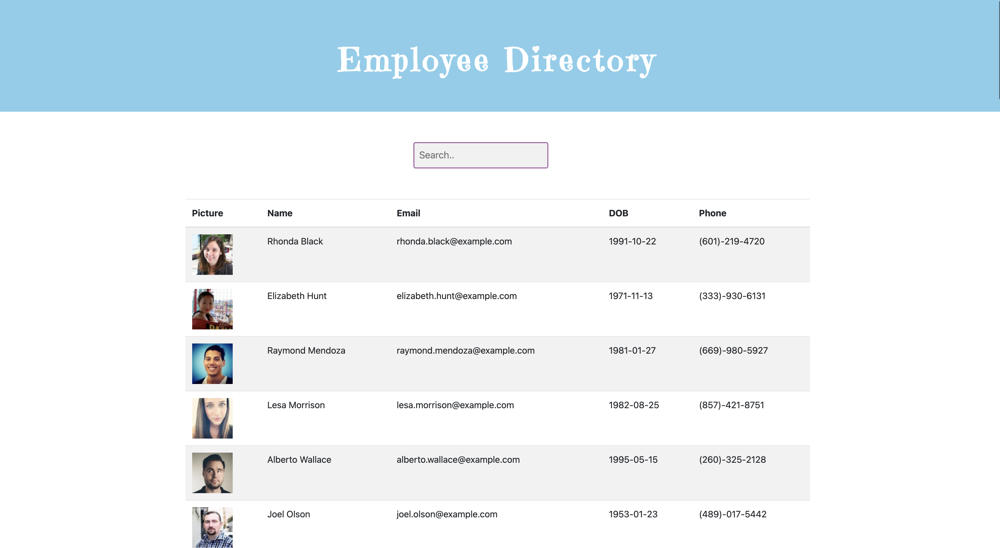
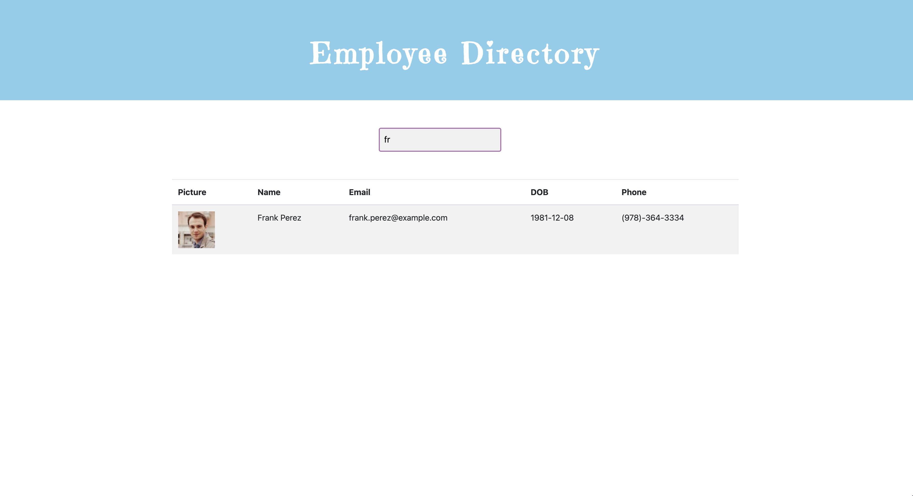

## Employee Directory 

## Table of Content

* [Description](#Description )
* [License](#License)
* [Contributing Guildline](#Contributing-Guildline)
* [Tests Instructions](#Tests-Instructions)
* [Questions](#Questions)

## Description
* A user will be able to view non-sensitive data (such as picture, name, phone, email, date of birth) of entire employee directory at once and also be able to filter employees by name. 

## License

## Contributing Guildeline
* I encourage public contributions.

## Tests Instructions
* The app showing entire employee directory non-sensitive data  

 

* The user will be able to filter employee by name. 

 

## Questions

  * Github user name :   saipurciful
  * Github link : https://github.com/Saipurciful
  * How to reach me with additional questions : <saipurciful@gmail.com>

## Link to the project site. 
* N/A
